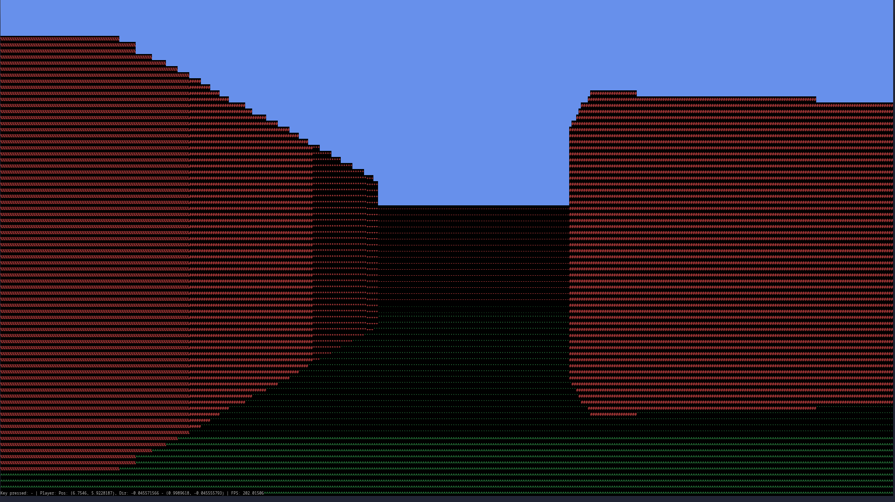

# Raycasting-engine



## Description

A simple 3D ASCII Console Renderer Engine written in Rust using ncurses.

### Project state

This is my "beginner project" to help me learn Rust. 
The project is still in an initial/prototype state, where everything is just in a big file.

The final goal is to implement a 3D ASCII render engine that uses the raycasting [technique](https://en.wikipedia.org/wiki/Wolfenstein_3D#Development) like the old good days. 
Currently the wall detection algorithm is quite inefficient and requires a lot of calculations.

## Todo

- [x] Write a README.md
- [ ] Refactoring to improve modularity
- [ ] Implementing better algorithm for wall detection
- [ ] Better shading, color shading
- [ ] Safer ncurses [API (?)](https://crates.io/crates/ncursesw)
- [ ] Benchmark to show the efficiency of various algorithms

## Build and run

**Requirements**: Ncurses and your terminal must support colors.

Clone the project:

```
git clone git@github.com:Hidan0/raycasting-engine.git --branch=main
```

and then build it:

```
cargo build [--release]
```

### Controls

|Keys|Description|
|---|---|
|<kbd>Shift+q</kbd>|Quit|
|<kbd>w</kbd>|Move forward|
|<kbd>s</kbd>|Move backward|
|<kbd>a</kbd>|Turn left|
|<kbd>d</kbd>|Turn right|

## License

GLP-3.0 License

